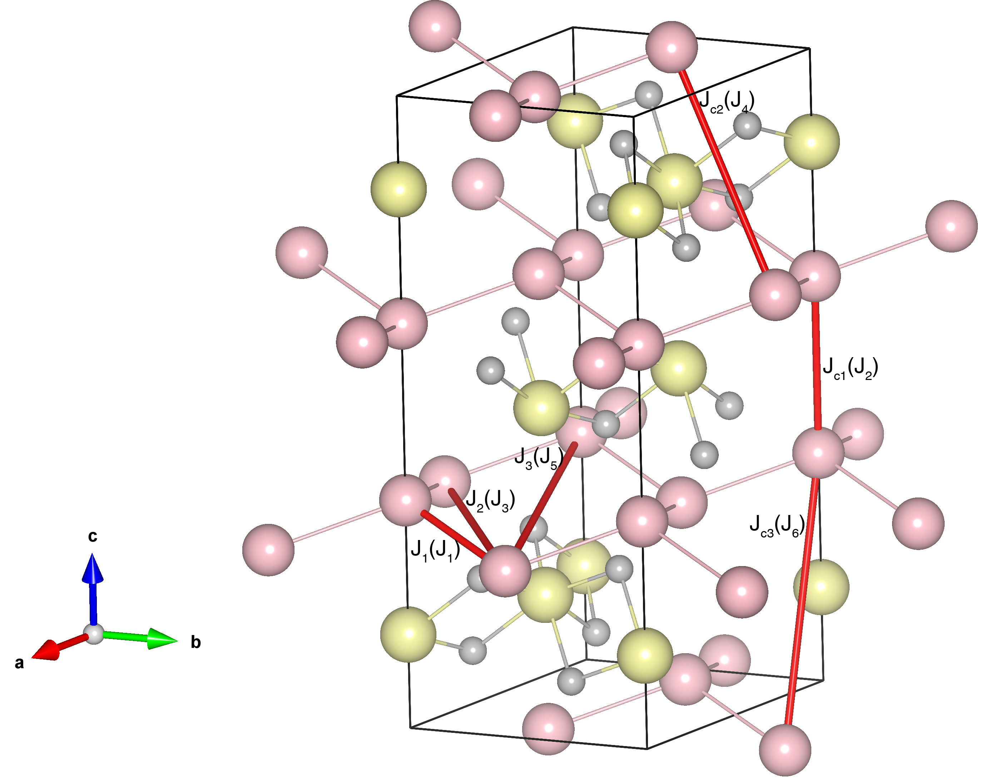

# MnTiO3

## Crystal and Heisenberg exchanges

| shell    | distance (A&#778;) | exchange J (meV) |
|----------|--------------|------------------|
| 1        | 3.064470     | -11.456          |
| 2        | 3.994282     | -3.169           |
| 3        | 5.138600     | -0.869           |
| 4        | 5.610475     | -0.819           |
| 5        | 5.982991     | 0.075            |
| 6        | 6.275134     | -0.794           |

## Monte Carlo, corrected Monte Carlo (TMC*) and Exp. transition temperature

| Texp (K) | TMC (K) | TMC* (K) | S   | Error (%) |
|----------------------|--------------------|--------------------------------|-----|-----------|
| 65.0                   | 45.0                 | 63.0                           | 2.5 | 3.1       |

## INS data:
[J. Phys. Soc. Jpn. 90, 064708](https://journals.jps.jp/doi/10.7566/JPSJ.90.064708)

## Exp. transition temperature:
[J. Phys. Soc. Jpn. 90, 064708](https://journals.jps.jp/doi/10.7566/JPSJ.90.064708)
