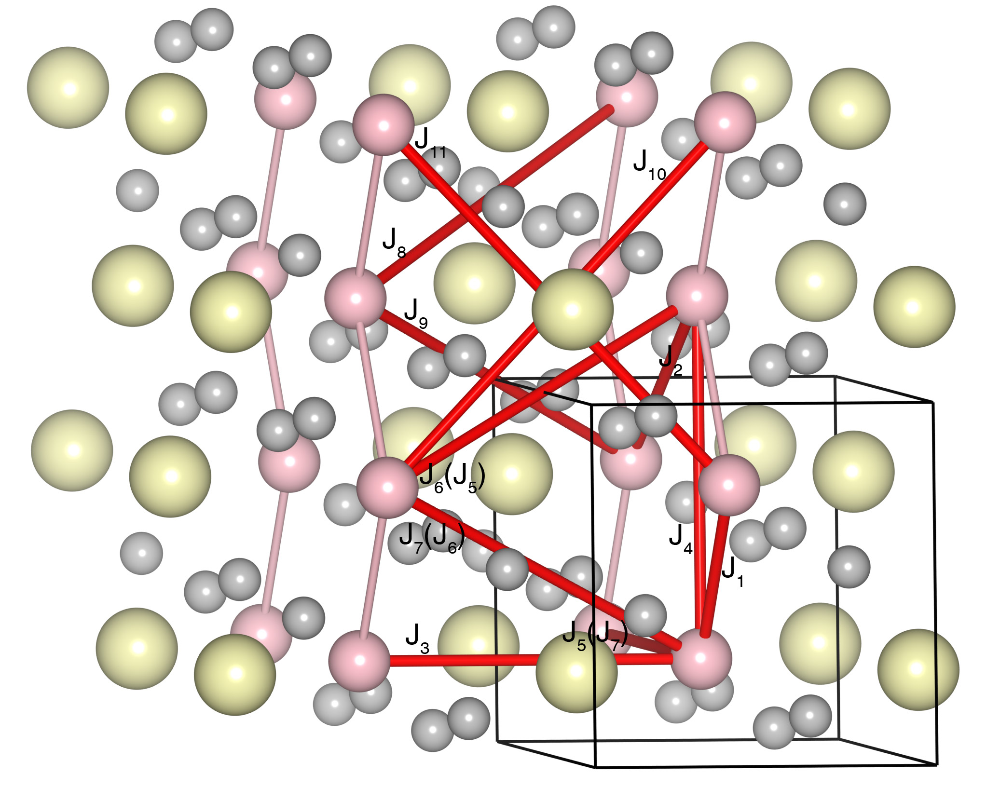

# MnWO4

## Crystal and Heisenberg exchanges

| shell    | distance (A&#778;) | exchange J (meV) |
|----------|--------------|------------------|
| 1        | 3.282823     | -1.194           |
| 2        | 4.398105     | -0.156           |
| 3        | 4.822600     | -0.619           |
| 4        | 4.992299     | -0.700           |
| 5        | 5.753300     | -0.037           |
| 6        | 5.795059     | -0.988           |
| 7        | 5.872485     | -0.375           |
| 8        | 6.492234     | -0.044           |
| 9        | 6.561439     | -0.613           |
| 10       | 6.875838     | -0.400           |
| 11       | 7.005990     | -0.100           |
| 12       | 7.507192     | -0.100           |

## Monte Carlo, corrected Monte Carlo (TMC*) and Exp. transition temperature

| Texp (K) | TMC (K) | TMC* (K) | S   | Error (%) |
|----------------------|--------------------|--------------------------------|-----|-----------|
| 13.5                   | 9.0                  | 12.6                           | 2.5 | 6.7       |

## INS data:
[Phys. Rev. B 98, 214425](https://journals.aps.org/prb/abstract/10.1103/PhysRevB.98.214425)

## Exp. transition temperature:
[Phys. Rev. B 98, 214425](https://journals.aps.org/prb/abstract/10.1103/PhysRevB.98.214425)
