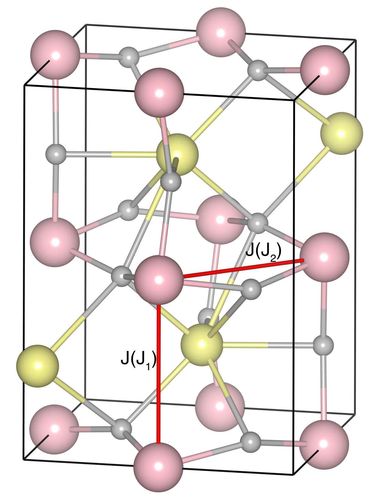

# NdFeO3

## Crystal and Heisenberg exchanges

| shell    | distance (A&#778;) | exchange J (meV) |
|----------|--------------|------------------|
| 1        | 3.880950     | -27.812          |
| 2        | 3.902694     | -27.812          |

## Monte Carlo, corrected Monte Carlo (TMC*) and Exp. transition temperature

| Texp (K) | TMC (K) | TMC* (K) | S   | Error (%) |
|----------------------|--------------------|--------------------------------|-----|-----------|
| 693.0                  | 463.0                | 648.2                          | 2.5 | 6.5       |

## INS data:
[Phys. Rev. B 84, 224115](https://journals.aps.org/prb/abstract/10.1103/PhysRevB.84.224115)

## Exp. transition temperature:
[Phys. Rev. B 84, 224115](https://journals.aps.org/prb/abstract/10.1103/PhysRevB.84.224115)
