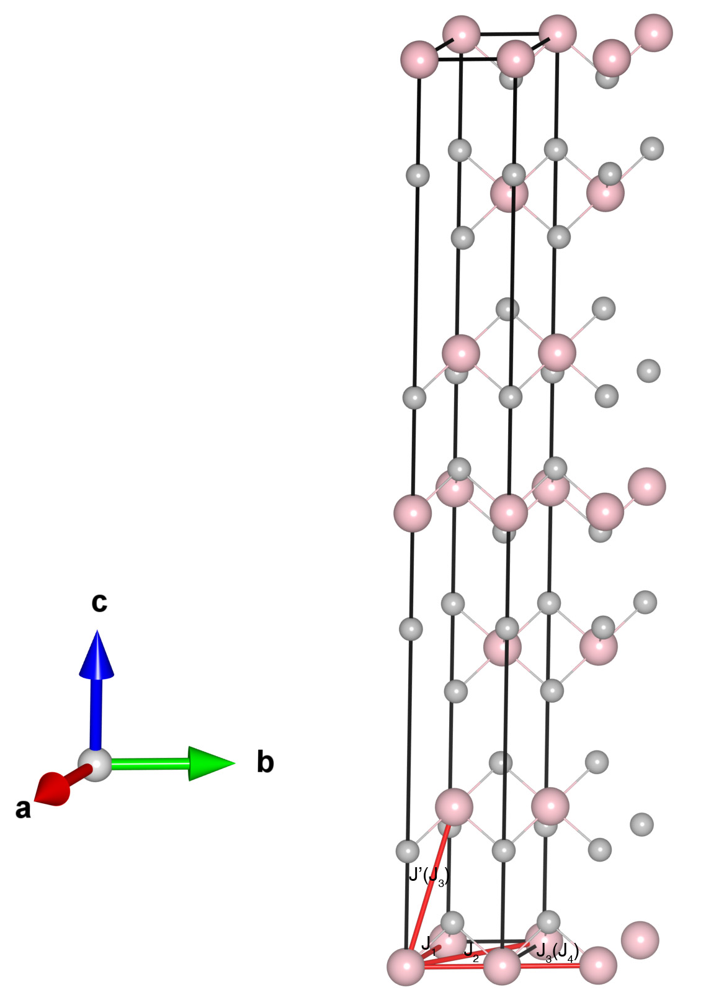

# NiBr2

## Crystal and Heisenberg exchanges

| shell    | distance (A&#778;) | exchange J (meV) |
|----------|--------------|------------------|
| 1        | 3.715000     | 3.120            |
| 2        | 6.434569     | -0.036           |
| 3        | 6.466096     | -0.364           |
| 4        | 7.430000     | -0.820           |

## Monte Carlo, corrected Monte Carlo (TMC*) and Exp. transition temperature

| Texp (K) | TMC (K) | TMC* (K) | S   | Error (%) |
|----------------------|--------------------|--------------------------------|-----|-----------|
| 52.0                   | 28.0                 | 56.0                           | 1.0 | 7.7       |

## INS data:
[J. Phys. France, 43, 1283](https://doi.org/10.1051/jphys:019820043080128300)

## Exp. transition temperature:
[J. Phys. France, 43, 1283](https://doi.org/10.1051/jphys:019820043080128300)
