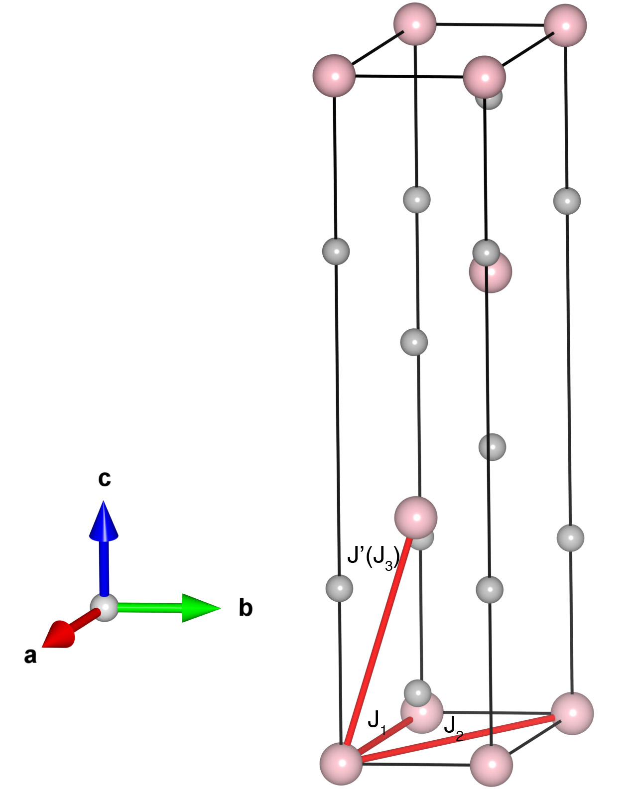

# NiCl2

## Crystal and Heisenberg exchanges

| shell    | distance (A&#778;) | exchange J (meV) |
|----------|--------------|------------------|
| 1        | 3.483000     | 3.741            |
| 2        | 6.032733     | -0.836           |
| 3        | 6.138710     | -0.133           |

## Monte Carlo, corrected Monte Carlo (TMC*) and Exp. transition temperature

| Texp (K) | TMC (K) | TMC* (K) | S   | Error (%) |
|----------------------|--------------------|--------------------------------|-----|-----------|
| 52.3                   | 36.0                 | 72.0                           | 1.0 | 37.7      |

## INS data:
[ J. Phys. C: Solid State Phys. 8 1059](https://iopscience.iop.org/article/10.1088/0022-3719/8/7/021)

## Exp. transition temperature:
[ J. Phys. C: Solid State Phys. 8 1059](https://iopscience.iop.org/article/10.1088/0022-3719/8/7/021)
