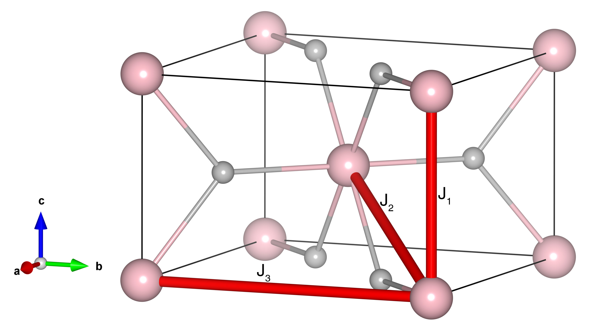

# NiF2

## Crystal and Heisenberg exchanges

| shell    | distance (A&#778;) | exchange J (meV) |
|----------|--------------|------------------|
| 1        | 3.083599     | 0.027            |
| 2        | 3.631390     | -1.719           |
| 3        | 4.649698     | 0.098            |

## Monte Carlo, corrected Monte Carlo (TMC*) and Exp. transition temperature

| Texp (K) | TMC (K) | TMC* (K) | S   | Error (%) |
|----------------------|--------------------|--------------------------------|-----|-----------|
| 73.2                   | 42.0                 | 84.0                           | 1.0 | 14.75     |

## INS data:
[Phys. Rev. B 2, 1362](https://journals.aps.org/prb/abstract/10.1103/PhysRevB.2.1362)

## Exp. transition temperature:
[Phys. Rev. B 2, 1362](https://journals.aps.org/prb/abstract/10.1103/PhysRevB.2.1362)
