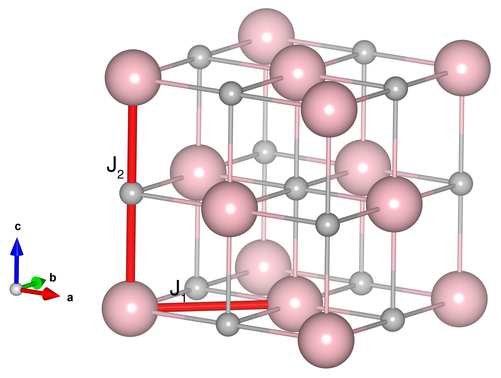

# NiO

## Crystal and Heisenberg exchanges

| shell    | distance (A&#778;) | exchange J (meV) |
|----------|--------------|------------------|
| 1        | 2.949342     | 1.370            |
| 2        | 4.171000     | -19.010          |

## Monte Carlo, corrected Monte Carlo (TMC*) and Exp. transition temperature

| Texp (K) | TMC (K) | TMC* (K) | S   | Error (%) |
|----------------------|--------------------|--------------------------------|-----|-----------|
| 523.0                  | 310.0                | 620.0                          | 1.0 | 18.54     |

## INS data:
[Phys. Rev. B 6, 3447](https://journals.aps.org/prb/abstract/10.1103/PhysRevB.6.3447)

## Exp. transition temperature:
[Phys. Rev. B 6, 3447](https://journals.aps.org/prb/abstract/10.1103/PhysRevB.6.3447)
