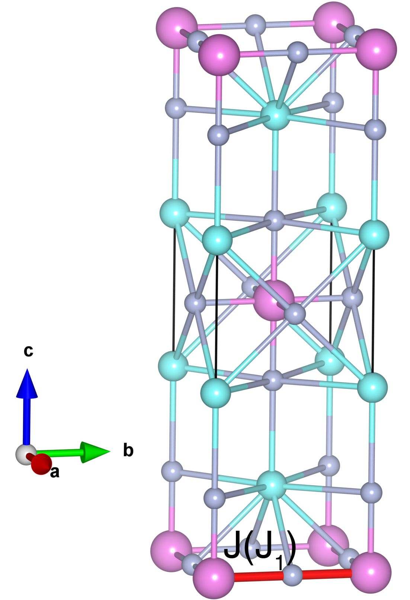

# Rb2MnF4

## Crystal and Heisenberg exchanges

| shell    | distance (A&#778;) | exchange J (meV) |
|----------|--------------|------------------|
| 1        | 4.215000     | -4.050           |

## Monte Carlo, corrected Monte Carlo (TMC*) and Exp. transition temperature

| Texp (K) | TMC (K) | TMC* (K) | S   | Error (%) |
|----------------------|--------------------|--------------------------------|-----|-----------|
| 38.4                   | 33.0                 | 46.2                           | 2.5 | 20.3      |

## INS data:
[Phys. Rev. B 72, 014413](https://doi.org/10.1103/PhysRevB.72.014413)

## Exp. transition temperature:
[Phys. Rev. B 72, 014413](https://doi.org/10.1103/PhysRevB.72.014413)
