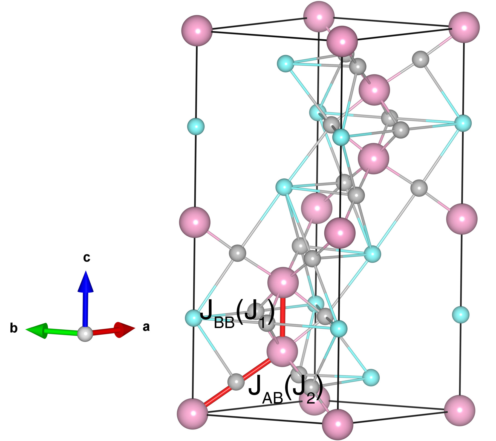

# RbMnCl3

## Crystal and Heisenberg exchanges

| shell    | distance (A&#778;) | exchange J (meV) |
|----------|--------------|------------------|
| 1        | 3.198702     | -9.125           |
| 2        | 5.025689     | -5.280           |
| 1        | 5.025689     | -5.280           |

## Monte Carlo, corrected Monte Carlo (TMC*) and Exp. transition temperature

| Texp (K) | TMC (K) | TMC* (K) | S   | Error (%) |
|----------------------|--------------------|--------------------------------|-----|-----------|
| 94.0                   | 69.0                 | 96.6                           | 2.5 | 2.8       |

## INS data:
[J. Appl. Phys. 52, 2225](https://doi.org/10.1063/1.328886)

## Exp. transition temperature:
[J. Appl. Phys. 52, 2225](https://doi.org/10.1063/1.328886)
