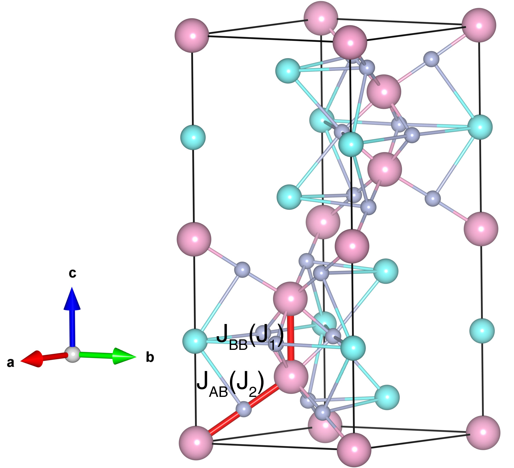

# RbNiF3

## Crystal and Heisenberg exchanges

| shell    | distance (A&#778;) | exchange J (meV) |
|----------|--------------|------------------|
| 1        | 4.033346     | -8.031           |
| 1        | 4.033346     | -8.031           |
| 1        | 2.727105     | 1.818            |
| 2        | 4.033346     | -8.031           |
| 2        | 4.033346     | -8.031           |

## Monte Carlo, corrected Monte Carlo (TMC*) and Exp. transition temperature

| Texp (K) | TMC (K) | TMC* (K) | S   | Error (%) |
|----------------------|--------------------|--------------------------------|-----|-----------|
| 133.0                  | 79.0                 | 158.0                          | 1.0 | 18.8      |

## INS data:
[Phys. Rev. B 6, 2030](https://doi.org/10.1103/PhysRevB.6.2030)

## Exp. transition temperature:
[Phys. Rev. B 6, 2030](https://doi.org/10.1103/PhysRevB.6.2030)
