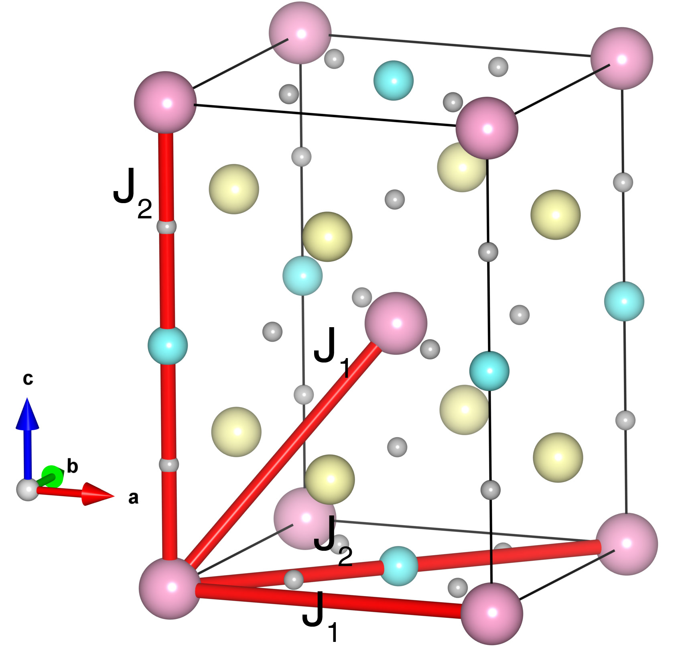

# Sr2NiWO6

## Crystal and Heisenberg exchanges

| shell    | distance (A&#778;) | exchange J (meV) |
|----------|--------------|------------------|
| 1        | 5.557100     | -0.024           |
| 2        | 5.576286     | -0.024           |
| 3        | 7.858926     | -1.810           |
| 4        | 7.913100     | -1.810           |

## Monte Carlo, corrected Monte Carlo (TMC*) and Exp. transition temperature

| Texp (K) | TMC (K) | TMC* (K) | S   | Error (%) |
|----------------------|--------------------|--------------------------------|-----|-----------|
| 54.0                   | 26.0                 | 52.0                           | 1.0 | 3.7       |

## INS data:
[J. Phys. Chem. Solids 60, 1173](https://doi.org/10.1016/S0022-3697(99)00075-X)

## Exp. transition temperature:
[J. Phys. Chem. Solids 60, 1173](https://doi.org/10.1016/S0022-3697(99)00075-X)
