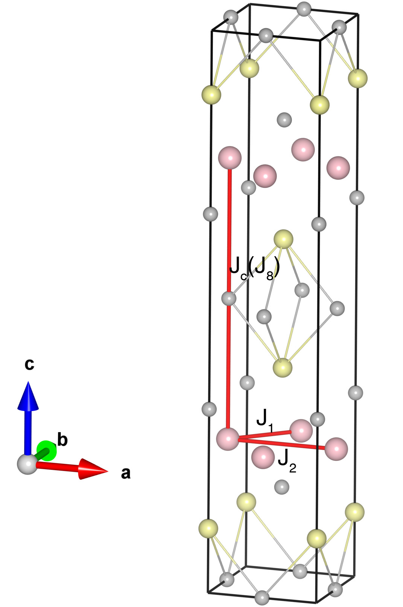

# SrMnBi2

## Crystal and Heisenberg exchanges

| shell    | distance (A&#778;) | exchange J (meV) |
|----------|--------------|------------------|
| 1        | 3.238549     | -53.250          |
| 2        | 4.580000     | -15.975          |
| 8        | 11.565001    | -0.275           |

## Monte Carlo, corrected Monte Carlo (TMC*) and Exp. transition temperature

| Texp (K) | TMC (K) | TMC* (K) | S   | Error (%) |
|----------------------|--------------------|--------------------------------|-----|-----------|
| 290.0                  | 219.0                | 306.6                          | 2.5 | 5.7       |

## INS data:
[Phys. Rev. B 95, 134405](https://journals.aps.org/prb/abstract/10.1103/PhysRevB.95.134405)

## Exp. transition temperature:
[Phys. Rev. B 95, 134405](https://journals.aps.org/prb/abstract/10.1103/PhysRevB.95.134405)
