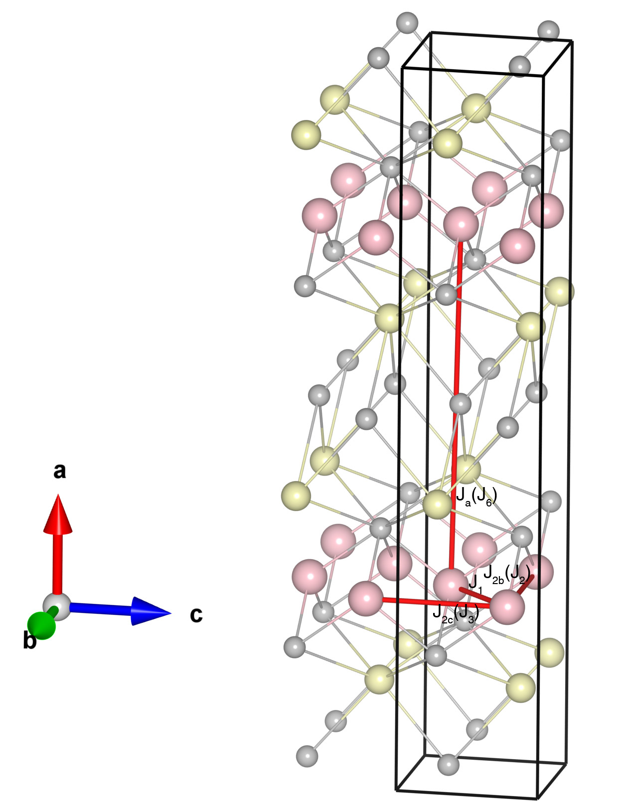

# SrMnSb2

## Crystal and Heisenberg exchanges

| shell    | distance (A&#778;) | exchange J (meV) |
|----------|--------------|------------------|
| 1        | 3.117684     | -55.920          |
| 2        | 4.384000     | -22.380          |
| 3        | 4.434000     | -15.560          |
| 14       | 11.507620    | 0.182            |

## Monte Carlo, corrected Monte Carlo (TMC*) and Exp. transition temperature

| Texp (K) | TMC (K) | TMC* (K) | S   | Error (%) |
|----------------------|--------------------|--------------------------------|-----|-----------|
| 297.0                  | 189.0                | 283.5                          | 2.0 | 4.5       |

## INS data:
[Phys. Rev. B 109, 214414](https://journals.aps.org/prb/abstract/10.1103/PhysRevB.109.214414)

## Exp. transition temperature:
[Phys. Rev. B 100, 014437](https://journals.aps.org/prb/abstract/10.1103/PhysRevB.100.014437)
