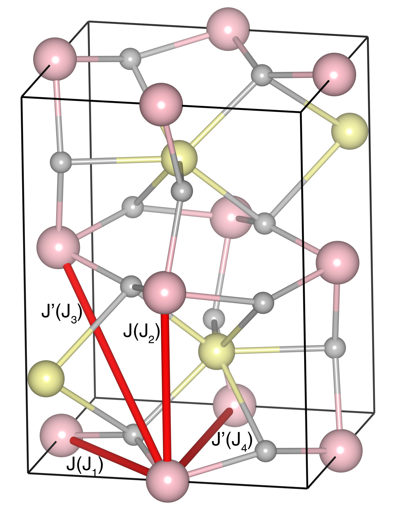

# TbFeO3

## Crystal and Heisenberg exchanges

| shell    | distance (A&#778;) | exchange J (meV) |
|----------|--------------|------------------|
| 1        | 3.817500     | -30.927          |
| 2        | 3.864863     | -30.927          |
| 3        | 5.326000     | -1.509           |
| 4        | 5.432354     | -1.509           |

## Monte Carlo, corrected Monte Carlo (TMC*) and Exp. transition temperature

| Texp (K) | TMC (K) | TMC* (K) | S   | Error (%) |
|----------------------|--------------------|--------------------------------|-----|-----------|
| 681.0                  | 456.0                | 638.4                          | 2.5 | 6.2       |

## INS data:
[Physica B 234, 760](https://www.sciencedirect.com/science/article/abs/pii/S0921452696011568)

## Exp. transition temperature:
[Physica B 234, 760](https://www.sciencedirect.com/science/article/abs/pii/S0921452696011568)
