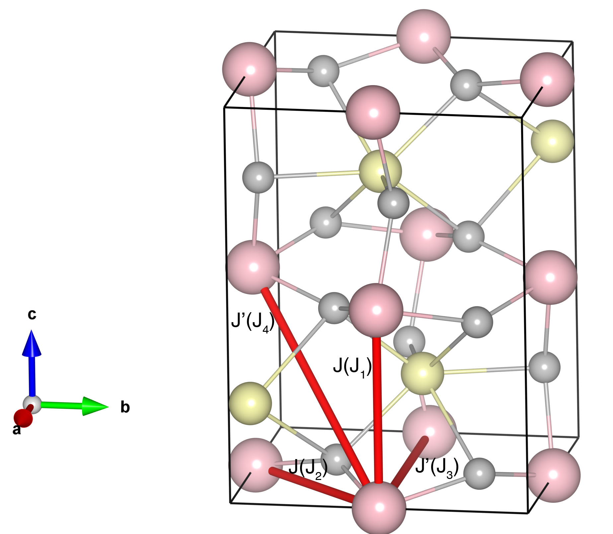

# TmFeO3

## Crystal and Heisenberg exchanges

| shell    | distance (A&#778;) | exchange J (meV) |
|----------|--------------|------------------|
| 1        | 3.792000     | -31.358          |
| 2        | 3.829647     | -31.358          |
| 3        | 5.251000     | -2.047           |
| 4        | 5.389384     | -2.047           |

## Monte Carlo, corrected Monte Carlo (TMC*) and Exp. transition temperature

| Texp (K) | TMC (K) | TMC* (K) | S   | Error (%) |
|----------------------|--------------------|--------------------------------|-----|-----------|
| 635.0                  | 442.0                | 618.8                          | 2.5 | 2.6       |

## INS data:
[Phys. Rev. B 10, 2014](https://journals.aps.org/prb/abstract/10.1103/PhysRevB.10.2014)

## Exp. transition temperature:
[j.jmmm.2020.167562](https://doi.org/10.1016/j.jmmm.2020.167562)
