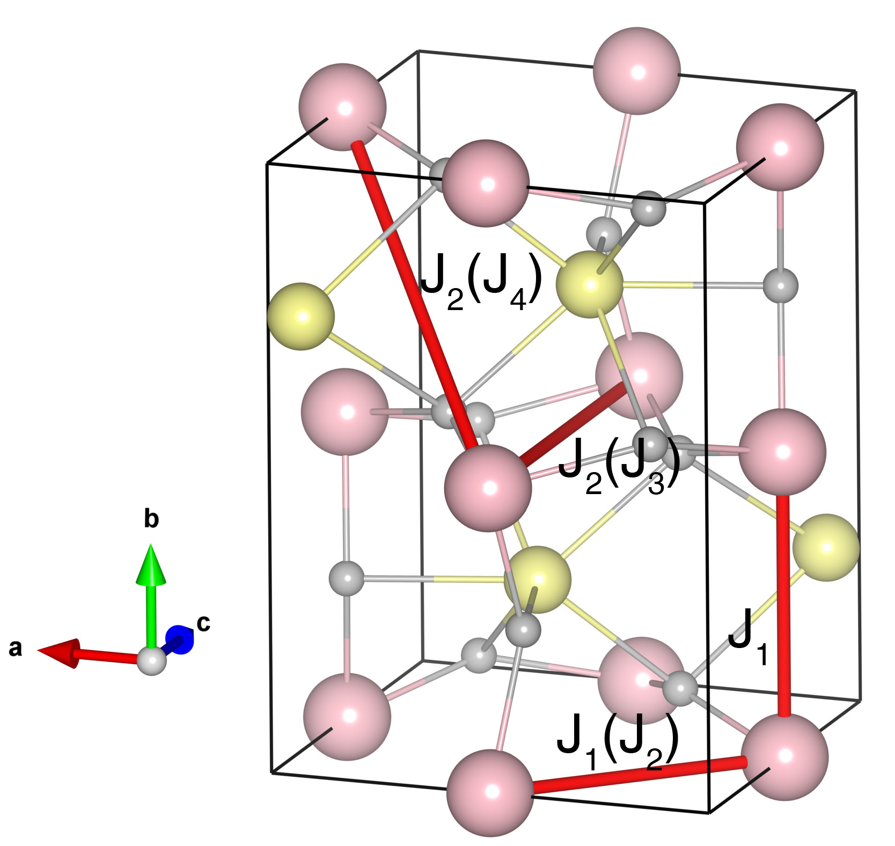

# YFeO3

## Crystal and Heisenberg exchanges

| shell    | distance (A&#778;) | exchange J (meV) |
|----------|--------------|------------------|
| 1        | 3.797753     | -29.812          |
| 2        | 3.842100     | -29.812          |
| 3        | 5.274581     | -1.312           |
| 4        | 5.402283     | -1.312           |

## Monte Carlo, corrected Monte Carlo (TMC*) and Exp. transition temperature

| Texp (K) | TMC (K) | TMC* (K) | S   | Error (%) |
|----------------------|--------------------|--------------------------------|-----|-----------|
| 644.5                  | 445.0                | 623.0                          | 2.5 | 3.3       |

## INS data:
[Phys. Rev. B 89, 014420](https://journals.aps.org/prb/abstract/10.1103/PhysRevB.89.014420)

## Exp. transition temperature:
[j.mseb.2008.12.020](https://www.sciencedirect.com/science/article/abs/pii/S0921510708006302)
