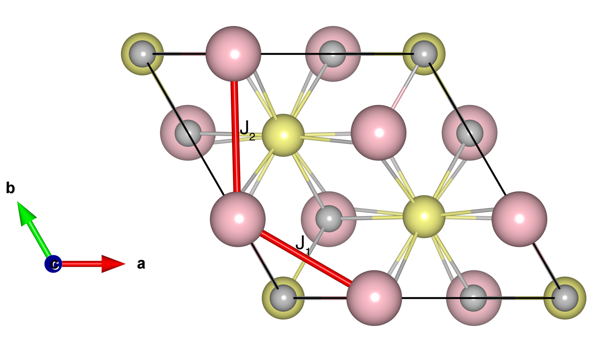

# YMnO3

## Crystal and Heisenberg exchanges

| shell    | distance (A&#778;) | exchange J (meV) |
|----------|--------------|------------------|
| 1        | 3.439681     | -13.600          |
| 2        | 3.606003     | -8.080           |

## Monte Carlo, corrected Monte Carlo (TMC*) and Exp. transition temperature

| Texp (K) | TMC (K) | TMC* (K) | S   | Error (%) |
|----------------------|--------------------|--------------------------------|-----|-----------|
| 70.0                   | 40.0                 | 60.0                           | 2.0 | 14.3      |

## INS data:
[Phys. Rev. B 68, 014432 ](https://journals.aps.org/prb/abstract/10.1103/PhysRevB.68.014432)

## Exp. transition temperature:
[Phys. Rev. B 68, 014432 ](https://journals.aps.org/prb/abstract/10.1103/PhysRevB.68.014432)
