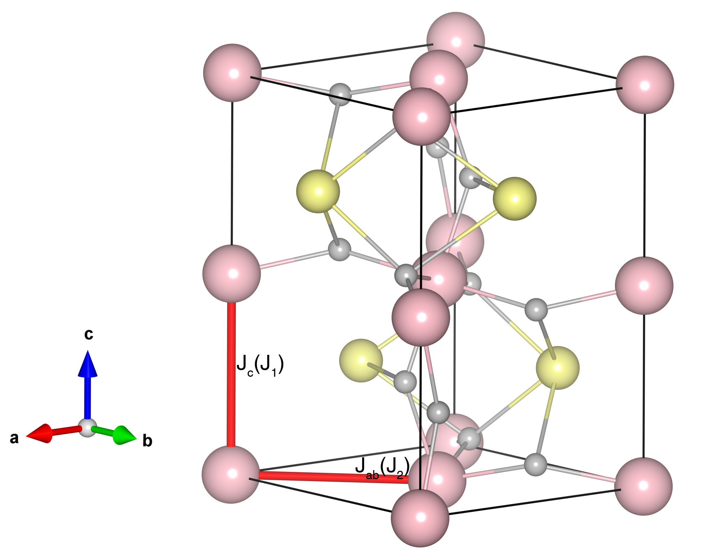

# YVO3

## Crystal and Heisenberg exchanges

| shell    | distance (A&#778;) | exchange J (meV) |
|----------|--------------|------------------|
| 1        | 3.775477     | -4.185           |
| 2        | 3.845105     | -2.600           |

## Monte Carlo, corrected Monte Carlo (TMC*) and Exp. transition temperature

| Texp (K) | TMC (K) | TMC* (K) | S   | Error (%) |
|----------------------|--------------------|--------------------------------|-----|-----------|
| 118.0                  | 59.0                 | 118.0                          | 1.0 | 0.0       |

## INS data:
[Phys. Rev. Lett. 91, 257202](https://journals.aps.org/prl/abstract/10.1103/PhysRevLett.91.257202)

## Exp. transition temperature:
[Phys. Rev. B 105, 094412](https://journals.aps.org/prb/abstract/10.1103/PhysRevB.105.094412)
