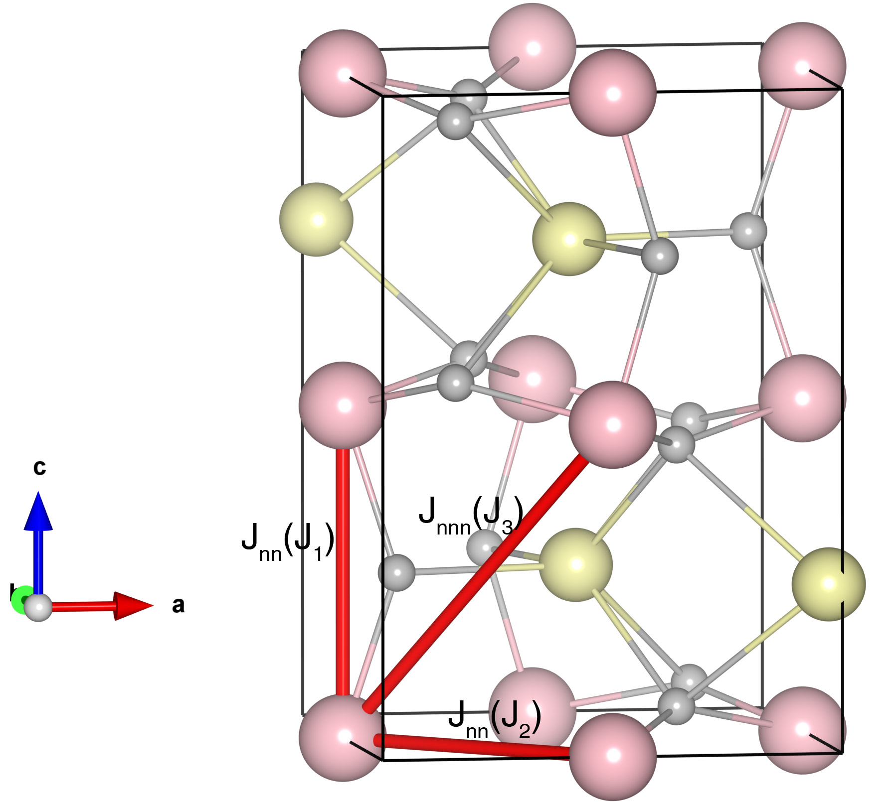

# YbFeO3

## Crystal and Heisenberg exchanges

| shell    | distance (A&#778;) | exchange J (meV) |
|----------|--------------|------------------|
| 1        | 3.817500     | -29.219          |
| 2        | 3.864863     | -29.219          |
| 3        | 5.326000     | -0.988           |
| 4        | 5.432354     | -0.988           |
| 5        | 5.602000     | -0.988           |

## Monte Carlo, corrected Monte Carlo (TMC*) and Exp. transition temperature

| Texp (K) | TMC (K) | TMC* (K) | S   | Error (%) |
|----------------------|--------------------|--------------------------------|-----|-----------|
| 627.0                  | 440.0                | 616.0                          | 2.5 | 1.75      |

## INS data:
[Phys. Rev. B 98, 064424](https://journals.aps.org/prb/abstract/10.1103/PhysRevB.98.064424)

## Exp. transition temperature:
[Applied Physics A 128, 1075](https://link.springer.com/article/10.1007/s00339-022-06235-z)
