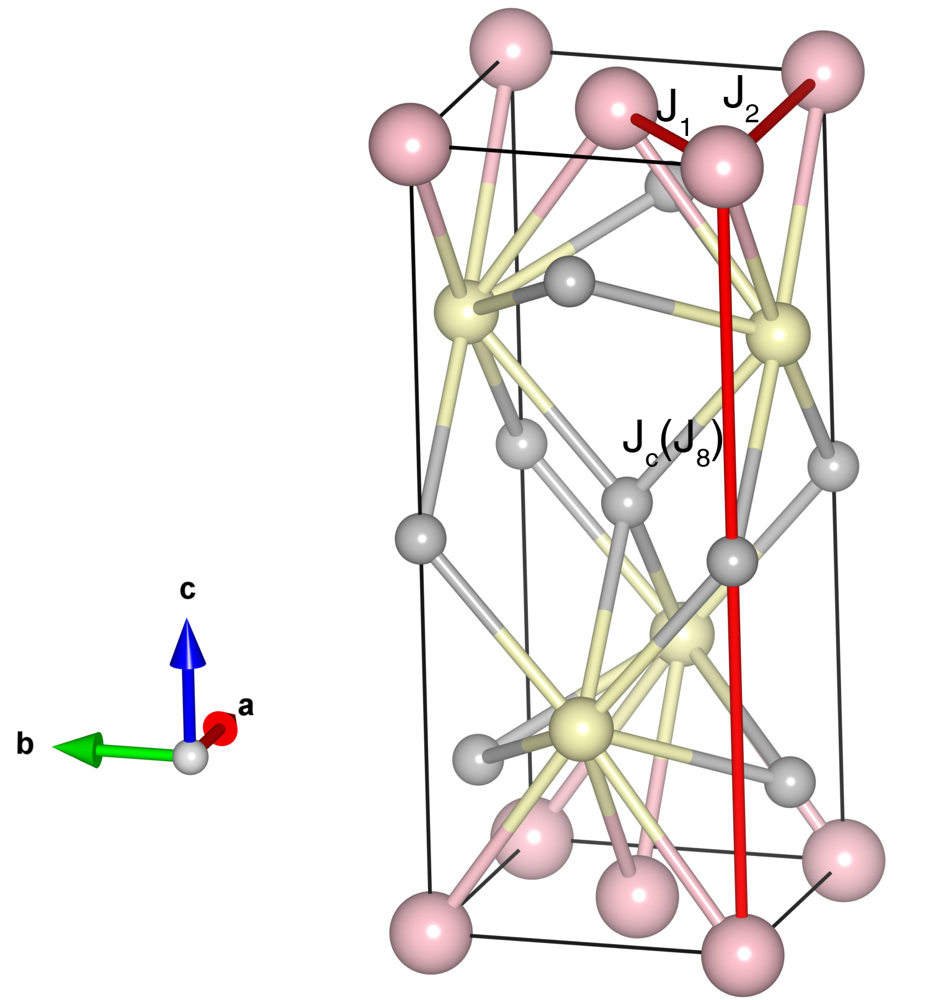

# YbMnSb2

## Crystal and Heisenberg exchanges

| shell    | distance (A&#778;) | exchange J (meV) |
|----------|--------------|------------------|
| 1        | 3.047630     | -70.000          |
| 2        | 4.310000     | -26.000          |
| 8        | 10.850000    | 1.825            |

## Monte Carlo, corrected Monte Carlo (TMC*) and Exp. transition temperature

| Texp (K) | TMC (K) | TMC* (K) | S   | Error (%) |
|----------------------|--------------------|--------------------------------|-----|-----------|
| 345.0                  | 266.0                | 372.4                          | 2.5 | 7.94      |

## INS data:
[Phys. Rev. B 107, 195146](https://journals.aps.org/prb/abstract/10.1103/PhysRevB.107.195146)

## Exp. transition temperature:
[Phys. Rev. B 107, 195146](https://journals.aps.org/prb/abstract/10.1103/PhysRevB.107.195146)
